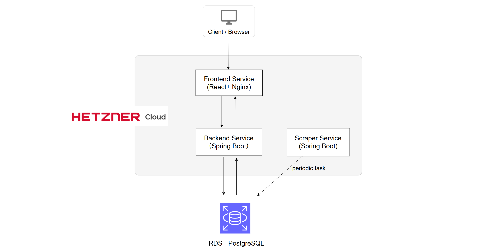
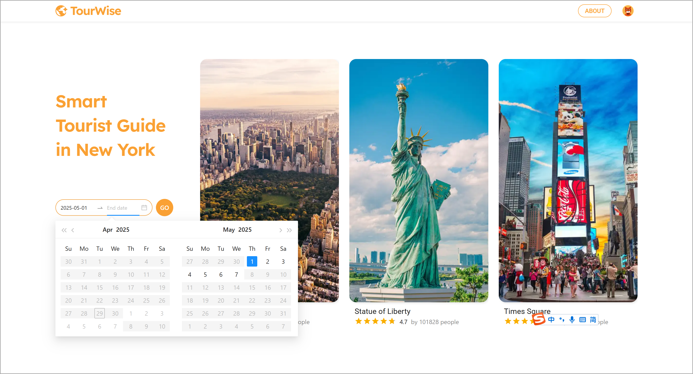
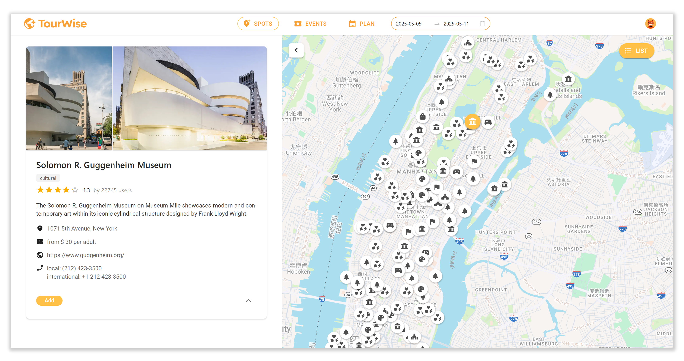
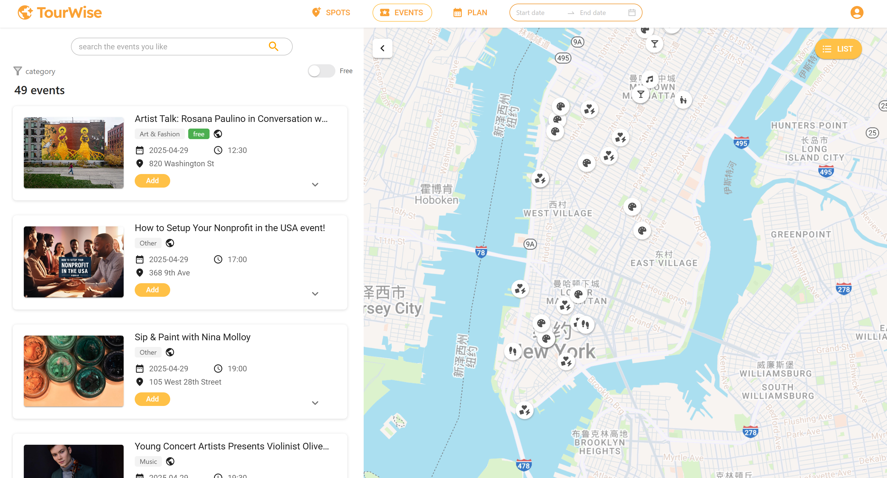
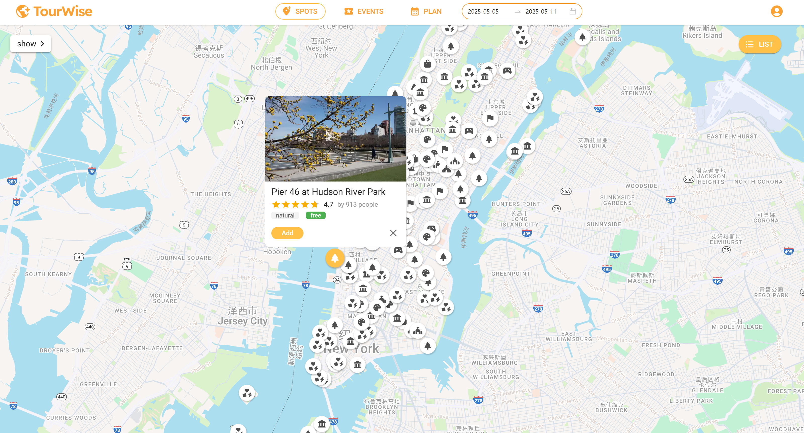
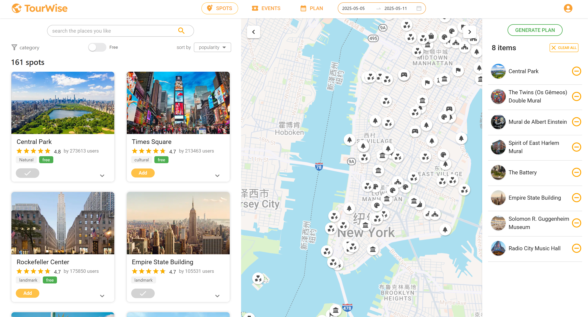
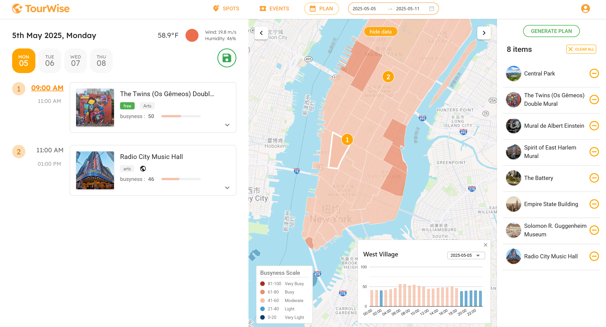
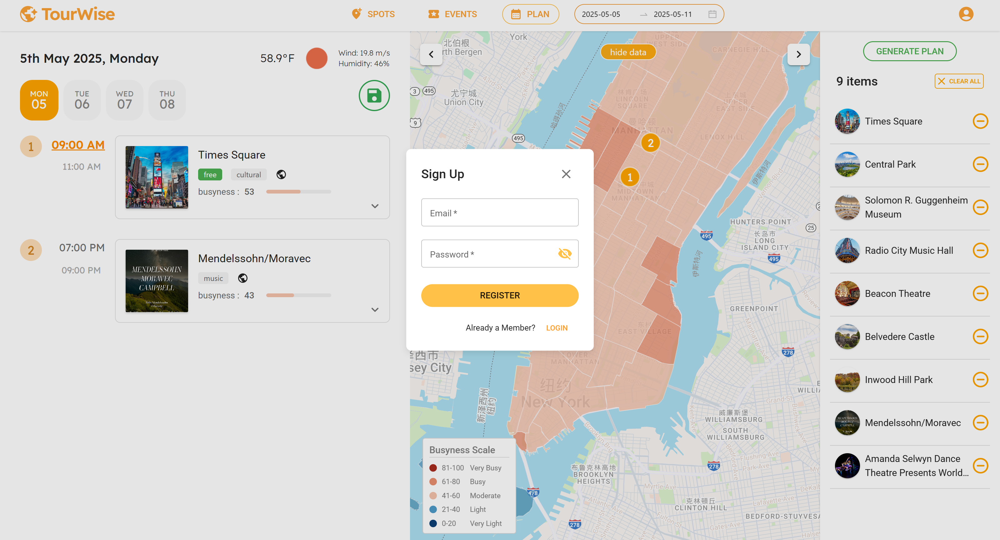
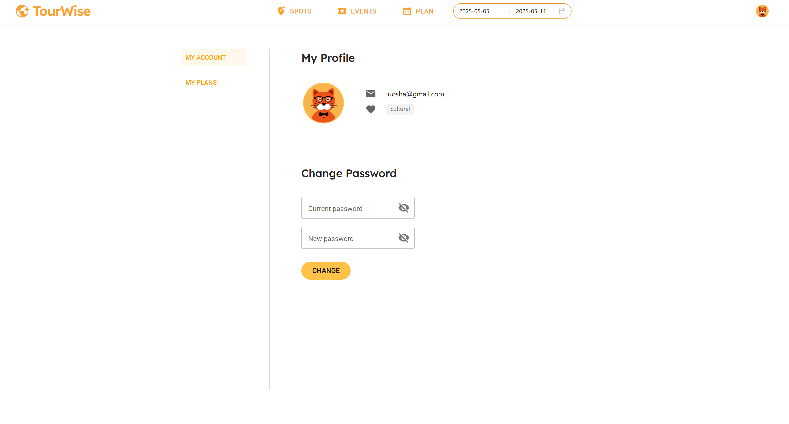
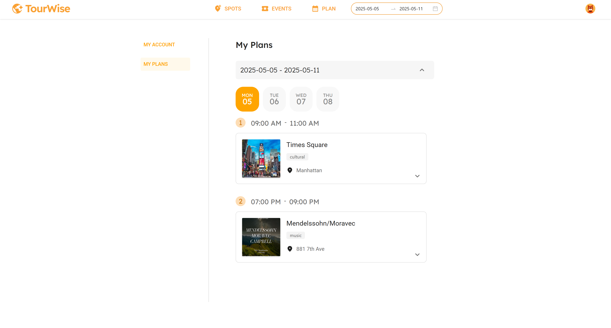

## Tourwise - Smart Tourist Guide for New York City 

### Live Demo

[http://tourwise.site](http://tourwise.site)

------

###  Project Overview

Tourwise is a smart tourist guide for New York City that helps visitors explore the city efficiently by recommending optimal times to visit Points of Interest (POIs), based on real-time and historical data.

By integrating datasets such as taxi trips, subway usage, and event schedules, the system builds a comprehensive understanding of urban crowd movement. It uses a machine learning model to predict crowd levels and generate a Busyness Index, allowing users to avoid peak times. The itinerary algorithm then creates personalized travel plans by balancing factors such as attraction hours, event timing, travel distance, and predicted crowd levels — ensuring each user's trip is both convenient and smooth.

This project was originally developed in an academic environment by a team of six members, each responsible for a specific module:

- **Coordination Lead**: Mustafa Tugrul Yilmaz
- **Data Lead**: Nathan Power
- **Backend Code Lead**: Boyu Wang
- **Frontend Code Lead**: Sha Luo
- **Customer Lead**: Maxim Zack Istasse
- **Maintenance Lead**: Jorge Durán González

Initially deployed on a private monolithic server, the system was later taken offline.

The current version was restructured and redeployed by **Sha Luo**, utilizing **AWS RDS (PostgreSQL)** for persistent storage and a **Hetzner server** for hosting. The deployment is containerized with **Docker** and automated through **GitHub Actions** for continuous integration and delivery (CI/CD). This update also introduces backend improvements such as persisting prediction results to the database—reducing reliance on in-memory storage and enhancing data availability. Several frontend bugs were fixed to improve stability and user experience.

------

### Tech Stack

- **UI Design**:  Figma, Photoshop
  
- **Frontend**:  React + TypeScript , Google Maps Platform, Google Charts, Google Fonts, Material UI, Ant Design
  
- **Backend**:  Spring Boot (Java), RESTful APIs

- **Scraper**:  Spring Boot (Java)

- **Database**: AWS RDS (PostgreSQL 17.4)

- **Model Training**:  Python (XGBoost)

- **Build Tool**:  Gradle (used in backend and scraper)

- **Deployment & Infrastructure**:  Docker, Docker Compose, Nginx, GitHub Actions,  Hetzner Cloud (CX22), Namecheap

------

###  System Architecture

- **Frontend Service** (React + Nginx): 

  A client-facing web application built with React and TypeScript. It provides an interactive interface for users to view attraction and event details, select preferred dates, and generate personalized itineraries. It communicates with the backend via REST APIs and dynamically renders prediction data and schedules using Google Charts and other UI components.

- **Backend Service** (Spring Boot): 

  Acts as the main business logic layer. It handles user authentication, itinerary generation, and serves as the central API gateway for data access and prediction services. It connects to the AWS RDS PostgreSQL database to fetch weather and event data and integrates with a machine learning model to predict busyness levels for taxi zones. It also includes a custom scheduling algorithm that intelligently assigns activities to available time slots based on busyness, user preferences, and real-time data.

- **Scraper Service** (Spring Boot): 

  A background service dedicated to data collection. It periodically pulls event information from the Yelp API and weather forecasts from OpenWeather, filters and transforms the raw data, and stores the results in a centralized AWS RDS PostgreSQL database. It also includes polygon-based geofiltering logic to restrict data collection to the Manhattan area.

Each service runs in its own Docker container, orchestrated with Docker Compose for simplified deployment, scaling, and maintenance.

In addition to the services, the platform relies on a centralized database component:

- AWS RDS PostgreSQL :

  Provides reliable and scalable persistent storage for all application data, including user accounts, itineraries, weather forecasts, event listings, and machine learning prediction results. A detailed schema is documented in `docs/schema.md`.

------

### Key Features

#### ● Plan Trips in Manhattan, NYC

Users can plan their travel within the next 30 days in Manhattan, New York City. On the landing page, users can select a start and end date for their trip.

#### ● Explore Popular Attractions in Manhattan

Browse nearly 200 well-known attractions in Manhattan. 

Users can search for attractions via the sidebar, apply category filters, or sort by popularity, rating, and whether the attraction is free.

Clicking an attraction card reveals additional details.

#### ●  View Upcoming Events in Manhattan

See events happening in the next 30 days. Events can be searched, filtered by type or whether they are free, and expanded to view full details.

#### ● Interactive Map View

Users can collapse the sidebar to view all attractions or events directly on the map, along with Dublin's public bike stations.

#### **● **Add Attractions and Events to Your Plan

Users can add their favorite attractions and events to a personal list. Items can be removed or cleared at any time.

#### ● Generate Optimized Itinerary Using ML-Based Routing Algorithms

After clicking "Generate Plan," the system creates a personalized travel itinerary using intelligent routing algorithms that are designed based on machine learning models. These models predict the future busyness levels of different taxi zones, enabling the itinerary to optimize routes and timings to avoid congestion. Users can inspect predicted congestion levels across taxi zones and interact with charts for detailed hourly insights.

#### ● Save Your Travel Plans

Users can register and log in to persistently save their travel plans.

#### ●  User Profile Management

In the user profile page, users can update their password and access previously saved travel plans.

#### ● Responsive Design for All Devices

The application is fully responsive and offers an optimal experience across all devices, including desktop, tablet (both orientations), and mobile.

------

### License

This project is licensed under the **GNU General Public License v2.0 (GPL-2.0)**.
