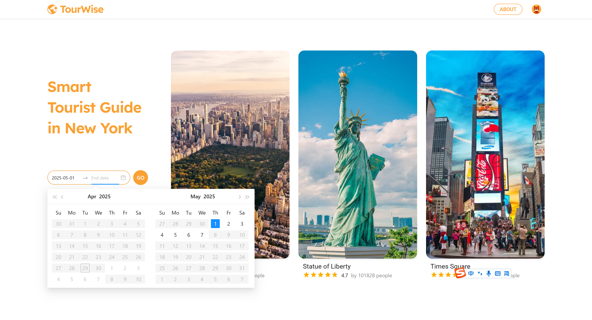

## Tourwise - Smart Tourist Guide for New York City 

### Live Demo

[http://tourwise.site](http://tourwise.site)

------

###  Project Overview

The Smart Tourist Guide for New York City is an innovative plan designed to enhance the travel experience for tourists by providing real-time information about Points of Interest (POI), focusing on recommending times to visit when these locations are least crowded. This project leverages multiple datasets and advanced technologies to deliver personalized, data-driven recommendations, ensuring tourists can explore the city efficiently and comfortably.

------

### Tech Stack

- **UI Design**:  Figma, Photoshop
  
- **Frontend**:  React + TypeScript , Google Maps Platform, Google Charts, Google Fonts, Material UI, Ant Design
  
- **Backend**:  Spring Boot (Java), RESTful APIs

- **Scraper**:  Spring Boot microservice (Java)

- **Database**: AWS RDS (PostgreSQL 17.4)

- **Model Training**:  Python (XGBoost)

- **Build Tool**:  Gradle (used in backend and scraper)

- **Deployment & Infrastructure**:  Docker, Docker Compose, Nginx, GitHub Actions,  Hetzner Cloud (CX22), Namecheap

------

###  System Architecture

- **Frontend Service** (React): 
- **Backend Service** (Spring Boot): 
- **Scraper Service** (Spring Boot): 

Each service runs in its own Docker container, orchestrated with Docker Compose for simplified deployment, scaling, and maintenance

In addition to the services, the platform relies on a centralized database component:

- **AWS RDS MySQL**: Provides reliable and scalable persistent storage for all application data.

  

------

### Key Features

#### ● Plan Trips in Manhattan, NYC

Users can plan their travel within the next 30 days in Manhattan, New York City. On the landing page, users can select a start and end date for their trip.

#### ● Explore Popular Attractions in Manhattan

Browse nearly 200 well-known attractions in Manhattan. 

Users can search for attractions via the sidebar, apply category filters, or sort by popularity, rating, and whether the attraction is free.

Clicking an attraction card reveals additional details.

#### ●  View Upcoming Events in Manhattan

See events happening in the next 30 days. Events can be searched, filtered by type or whether they are free, and expanded to view full details.

#### ● Interactive Map View

Users can collapse the sidebar to view all attractions or events directly on the map, along with Dublin's public bike stations.

#### **● **Add Attractions and Events to Your Plan

Users can add their favorite attractions and events to a personal list. Items can be removed or cleared at any time.

#### ● Generate Optimized Itinerary Using ML-Based Routing Algorithms

After clicking "Generate Plan," the system creates a personalized travel itinerary using intelligent routing algorithms that are designed based on machine learning models. These models predict the future busyness levels of different taxi zones, enabling the itinerary to optimize routes and timings to avoid congestion. Users can inspect predicted congestion levels across taxi zones and interact with charts for detailed hourly insights.

#### ● Save Your Travel Plans

Users can register and log in to persistently save their travel plans.

#### ●  User Profile Management

In the user profile page, users can update their password and access previously saved travel plans.

#### **● **Responsive Design for All Devices

The application is fully responsive and offers an optimal experience across all devices, including desktop, tablet (both orientations), and mobile.

------

